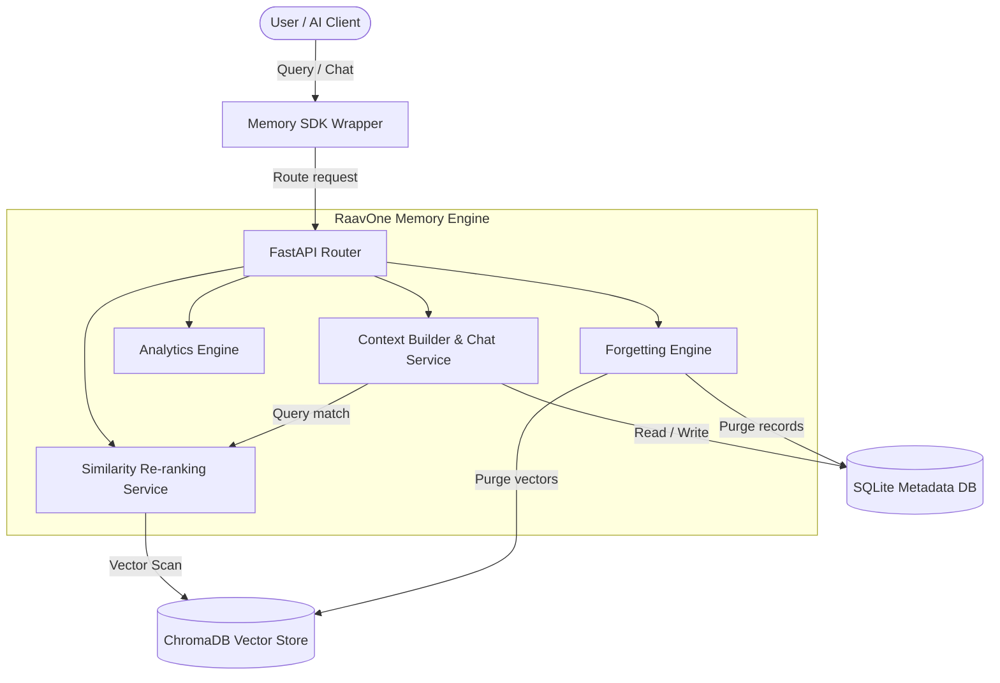
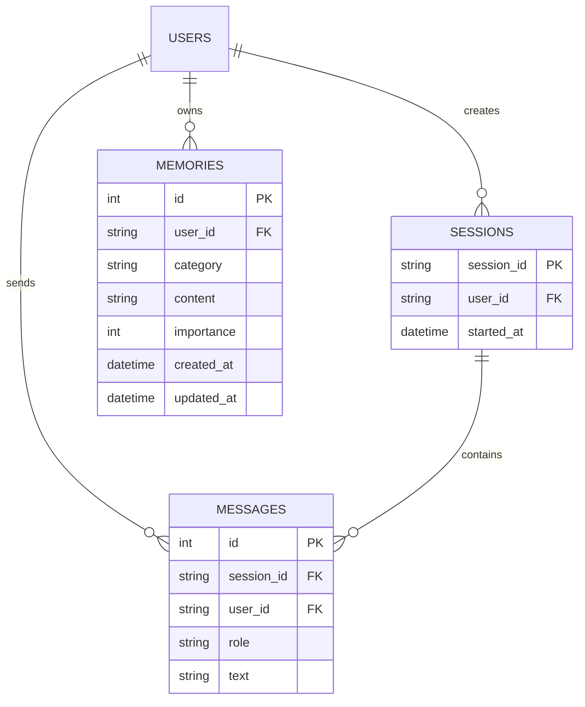

<div align="center">

# 🧠 RaavOne Memory Engine `v3.0`

[](https://github.com/mogesh-developer/RaavOne-Memory)
[](https://www.python.org/)
[](https://fastapi.tiangolo.com/)
[](https://www.trychroma.com/)
[](https://www.sqlalchemy.org/)

**An intelligent, autonomous long-term semantic memory & user profiling engine built for AI agents and personalized chat assistants.**

[Key Features](#-all-features--capabilities) •
[Architecture](#-system-architecture) •
[Installation](#-installation--run) •
[Quick Start](#-quick-start-sdk-usage) •
[API Examples](#-api-examples) •
[Folder Structure](#-folder-structure) •
[Roadmap](#-roadmap-status)

---

</div>

## 📌 Overview

Standard LLMs suffer from **context window amnesia**—when a session resets, all previous knowledge about the user is lost. 

**RaavOne Memory v3.0** resolves this by introducing a dual-layered long-term storage engine. It decouples SQLite (relational source of truth for message histories and category metadata) and ChromaDB (high-speed vector store indexing embeddings). It automatically extracts profile categories, tracks learning progress chronologically, purges stale items via importance decay, and handles conflict resolution in real-time.

---

## 🔥 All Features & Capabilities

Here is the complete list of features available in **RaavOne Memory v3.0**:

### 📦 1. Multi-User Isolation & Partitioning
- **Partitioned Queries**: Enforces strict boundaries to ensure User A can never search, read, or overwrite User B's memories.
- **Audited Lookups**: Validates SQLite fetches and ChromaDB filters by user IDs.

### 🧠 2. Context Builder & Personalized Chat
- **Similarity Ranking**: Combines Cosine Similarity, Recency, and Frequency to rank the best matching context facts.
- **Context Injection**: Formulates custom system instructions dynamically in real-time.

### ⚡ 3. Memory Category Classification (10 Domains)
Categorizes user knowledge into 10 structured domains:
`Skill`, `Project`, `Interest`, `Preference`, `Experience`, `Tool`, `Goal`, `Work`, `Location`, `Relationship`.

### ⌛ 4. Chronological Timeline Engine
Provides structured progress tracking over time:
- Injects dates and events into an LLM progression visualizer (`GET /memory/timeline/{user_id}`).

### 🗑️ 5. Forgetting Engine
Automated garbage collection cleans up low-importance temporary data (cutoff at 30 days) while protecting high-importance user attributes.

### 🔄 6. Conflict Resolution & Overwrites
Detects state conflicts (e.g. changing favorite framework) and merges or replaces outdated statements using JSON extraction.

---

## 🏗️ System Architecture



---

## 🗄️ Database Entity Relationship



---

## 🚀 Installation & Run

### Prerequisites
- **Python 3.10+**
- **pip** with virtual environment

```bash
# 1. Clone repository
git clone https://github.com/mogesh-developer/RaavOne-Memory.git
cd RaavOne-Memory

# 2. Setup Virtual Environment
python -m venv venv
venv\Scripts\activate  # On Windows

# 3. Install dependencies
pip install .

# 4. Create .env file with API Keys
echo GROQ_API_KEY=your_api_key_here > .env

# 5. Start Server
uvicorn app.main:app --reload
```

---

## ⚡ Quick Start (SDK Usage)

You can easily integrate **RaavOne Memory** directly into your Python apps:

```python
from raavone_core import Memory

# 1. Chat personalized with long-term memory context
response = Memory.chat(user_id="mogesh", message="Suggest a backend framework.")
print("Assistant:", response)

# 2. Get summarized persona profile
profile = Memory.get_profile(user_id="mogesh")
print("User Persona:\n", profile)

# 3. Get user progress timeline
timeline = Memory.get_timeline(user_id="mogesh")
print("User Timeline:\n", timeline)

# 4. Get database metrics analytics
stats = Memory.get_analytics(user_id="mogesh")
print("Stats:", stats)
```

---

## 📡 API Examples

### 1. Semantic Memory Search
`POST /memory/search`
```bash
curl -X 'POST' \
  'http://localhost:8000/memory/search' \
  -H 'Content-Type: application/json' \
  -d '{
  "user_id": "mogesh",
  "query": "coding language"
}'
```

### 2. User Memory Analytics
`GET /memory/analytics/{user_id}`
```bash
curl -X 'GET' 'http://localhost:8000/memory/analytics/mogesh'
```

### 3. Cleanup Expiring memories
`POST /memory/cleanup`
```bash
curl -X 'POST' 'http://localhost:8000/memory/cleanup?days=30&importance_limit=3'
```

---

## 📂 Folder Structure

```
RaavOne-Memory/
│
├── app/
│   ├── models/           # SQLAlchemy schemas (Memory, Message, Session)
│   ├── routes/           # FastAPI router endpoints (chat, memory)
│   ├── schemas/          # Pydantic schemas (message, chat, memory)
│   ├── services/         # Core business logic (chat, profile, timeline, forgetting)
│   ├── prompts/          # System prompts templates
│   ├── database.py       # SQLite db connections
│   └── main.py           # FastAPI entrypoint
│
├── raavone_core/         # SDK wrapper classes (Memory)
│
├── tests/                # PyTest suite files
│   ├── conftest.py
│   ├── test_chat.py
│   ├── test_memory.py
│   ├── test_profile.py
│   └── test_search.py
│
├── pyproject.toml        # Poetry / pip configuration
└── README.md             # Documentation
```

---

## 🗺️ Roadmap Status

* [x] **Base Infrastructure & SQLite Schema**
* [x] **Vector Store Indexing (ChromaDB)**
* [x] **Context Builder & Personalized Chat** (Phase 1)
* [x] **Memory Category Classification** (Phase 2)
* [x] **Importance Ranking Model** (Phase 3)
* [x] **Memory Summarizer Profile** (Phase 4)
* [x] **Chronological Timeline Engine** (Phase 5)
* [x] **Forgetting Engine Garbage Collection** (Phase 6)
* [x] **Conflict Resolution & State Merges** (Phase 7)
* [x] **Multi-user Data Isolation Auditing** (Phase 8)
* [x] **Memory Analytics & Metrics Stats** (Phase 9)
* [x] **Unified SDK Wrapper Client** (Phase 10)
