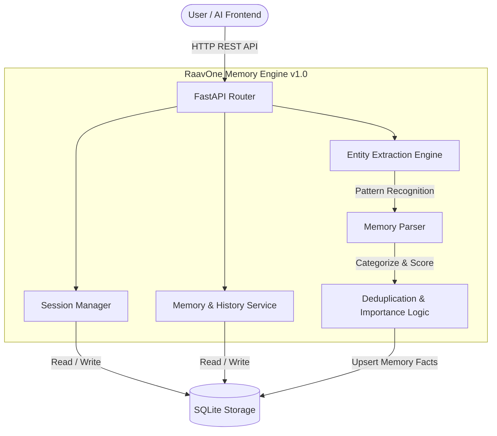
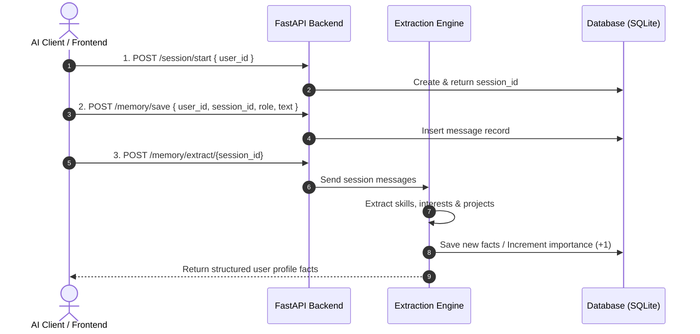
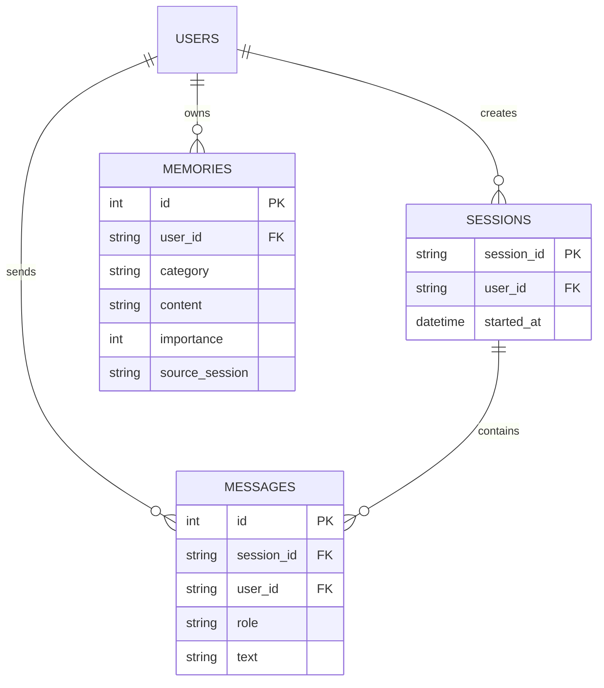

<div align="center">

# 🧠 RaavOne Memory Engine `v1.0`

[](https://github.com/mogesh-developer/RaavOne-Memory/releases/tag/v1.0)
[](https://www.python.org/)
[](https://fastapi.tiangolo.com/)
[](https://www.sqlalchemy.org/)
[](https://docs.pydantic.dev/)

**An intelligent, local-first long-term memory & automated user profiling engine built for autonomous AI agents and chat assistants.**

[Key Features](#-all-features--capabilities) •
[Architecture](#-system-architecture) •
[Data Flow](#-how-it-works-data-flow) •
[API Specs](#-complete-api-specifications) •
[Getting Started](#-getting-started)

---

</div>

## 📌 Overview

Standard LLMs suffer from **context window amnesia**—when a session resets, all previous knowledge about the user is lost. 

**RaavOne Memory v1.0** solves this by providing a dedicated local memory backend. It stores multi-session chat histories, automatically extracts entity profiles (skills, interests, projects), and dynamically calculates memory importance weights for autonomous AI assistants.

---

## 🔥 All Features & Capabilities

Here is the complete list of features available in **RaavOne Memory v1.0**:

### 📦 1. Session Management
- [x] **Session Initialization**: Generate unique session IDs (`/session/start`) tied to specific user IDs with ISO timestamping.
- [x] **Session Message Fetching**: Retrieve the complete chronological chat log for any active or past session (`/session/{session_id}`).

### 💬 2. Message & Chat History Storage
- [x] **Role-Based Message Logging**: Save incoming user and assistant interactions with system metadata (`/memory/save`).
- [x] **Global User History**: Fetch full conversation logs for a user across all sessions (`/memory/history/{user_id}`).
- [x] **Raw & Extracted View**: View raw chat logs alongside structured memory profiles (`/memory/all/{user_id}`).

### 🧠 3. Automated Memory & Entity Extraction
- [x] **Automatic Parsing**: Scans raw session texts for developer skills, frameworks, interests, and project references (`/memory/extract/{session_id}`).
- [x] **Smart Categorization**: Automatically groups extracted knowledge into predefined categories (`skill`, `project`, `interest`).
- [x] **Importance Score Weighting**: Deduplicates extracted facts and increments an `importance` score (`importance + 1`) whenever a fact is repeatedly mentioned across sessions.

### 🔒 4. Local-First & Privacy Architecture
- [x] **Zero Cloud Lock-in**: Lightweight SQLite database storage engine out of the box.
- [x] **Asynchronous DB Engine**: Built with SQLAlchemy 2.0 ORM for non-blocking I/O performance.
- [x] **Interactive OpenAPI Docs**: Auto-generated Swagger (`/docs`) and ReDoc (`/redoc`) API testing interfaces.

---

## 🏗️ System Architecture



---

## 🔄 How It Works (Data Flow)



---

## 📡 Complete API Specifications

| Category | Method | Endpoint | Description | Status |
| :--- | :---: | :--- | :--- | :---: |
| **System** | `GET` | `/` | Health check & engine status | `v1.0` |
| **Session** | `POST` | `/session/start` | Start a new user session | `v1.0` |
| **Session** | `GET` | `/session/{session_id}` | Retrieve messages for a given session | `v1.0` |
| **Memory** | `POST` | `/memory/save` | Save raw user/assistant message | `v1.0` |
| **Memory** | `GET` | `/memory/history/{user_id}` | Get complete chat history for a user | `v1.0` |
| **Memory** | `GET` | `/memory/all/{user_id}` | Get all long-term memory facts for a user | `v1.0` |
| **Extraction**| `POST` | `/memory/extract/{session_id}` | Extract & store profile facts from session | `v1.0` |

---

## 🗄️ Database Entity Relationship



---

## 🚀 Getting Started

### Prerequisites
- **Python 3.10+**
- **Poetry**

### Installation & Run

```bash
# 1. Clone repo
git clone https://github.com/mogesh-developer/RaavOne-Memory.git
cd RaavOne-Memory

# 2. Install dependencies
poetry install

# 3. Start server
poetry run uvicorn app.main:app --reload --host 0.0.0.0 --port 8000
```

### Interactive API Explorer
Once the server is running, explore APIs at:
- **Swagger UI**: [http://localhost:8000/docs](http://localhost:8000/docs)
- **ReDoc**: [http://localhost:8000/redoc](http://localhost:8000/redoc)

---

<div align="center">

Built with ❤️ by [mogesh-developer](https://github.com/mogesh-developer)

</div>
