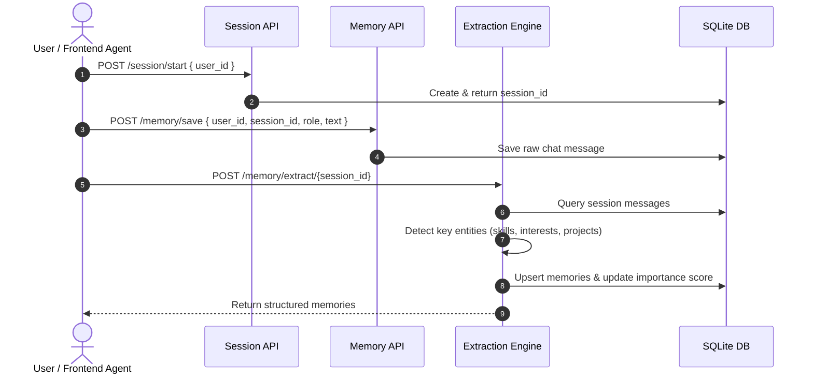
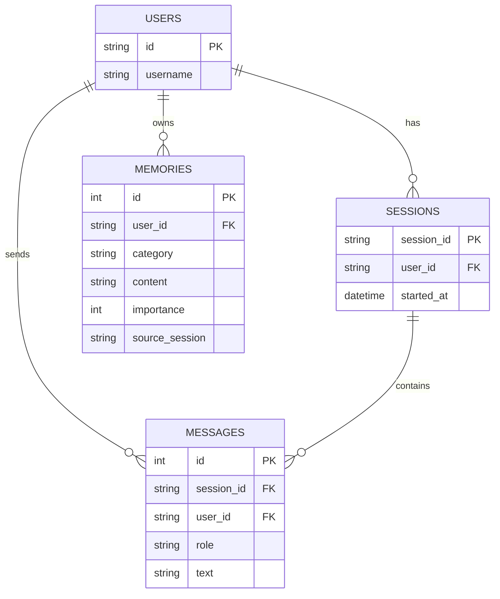

<div align="center">

# 🧠 RaavOne Memory Engine

[](https://www.python.org/)
[](https://fastapi.tiangolo.com/)
[](https://www.sqlalchemy.org/)
[](https://docs.pydantic.dev/)
[](#)

**An intelligent, local-first long-term memory & user profiling engine built for autonomous AI agents and chat assistants.**

[Why Use This?](#-why-raavone-memory-use-case) •
[Core Capabilities](#-core-capabilities--functions) •
[Data Flow](#-how-it-works-data-flow) •
[API Reference](#-detailed-api-reference) •
[Getting Started](#-getting-started)

---

</div>

## 🎯 Why RaavOne Memory? (Use Case)

Standard LLM chat applications suffer from **context amnesia**—once a session ends, the AI forgets everything about the user.

**RaavOne Memory** acts as a long-term memory backend for AI assistants:
- 💾 **Session History**: Persists every chat message per session.
- 🔍 **Automated Fact Extraction**: Automatically analyzes user messages to identify key skills, tech stack, interests, and projects.
- 📈 **Importance Weighting**: Increments importance scores when user facts (e.g. `Python`, `FastAPI`, `AI`) are repeatedly mentioned across sessions.
- ⚡ **Zero Cloud Dependency**: Lightweight, local SQLite database backend for maximum user privacy.

---

## 🔥 Core Capabilities & Functions

### 1. 💬 Chat & Session Tracking (`/session`)
- Starts isolated user sessions with start timestamps (`/session/start`).
- Fetches all historical messages associated with a specific `session_id` (`/session/{session_id}`).

### 2. 📝 Message Logging & Querying (`/memory`)
- Logs raw incoming user/assistant messages (`/memory/save`).
- Retrieves complete raw message history for a user across all sessions (`/memory/history/{user_id}`).
- Returns all structured long-term memory facts stored for a user (`/memory/all/{user_id}`).

### 3. 🧠 Smart Fact Extraction (`/memory/extract`)
- Scans chat sessions to extract categories such as `skill`, `interest`, or `project`.
- Deduplicates memory entries and updates importance scores (`importance + 1`) automatically when repeated.

---

## 🔄 How It Works (Data Flow)



---

## 📡 Detailed API Reference

| Section | Method | Endpoint | Description |
| :--- | :---: | :--- | :--- |
| **System** | `GET` | `/` | Service health status check |
| **Session** | `POST` | `/session/start` | Create a new user session ID |
| **Session** | `GET` | `/session/{session_id}` | Retrieve all chat messages in a session |
| **Memory** | `POST` | `/memory/save` | Store a new raw conversation message |
| **Memory** | `GET` | `/memory/history/{user_id}` | Fetch full message history for a user |
| **Memory** | `GET` | `/memory/all/{user_id}` | Fetch all extracted long-term memory facts |
| **Extraction**| `POST` | `/memory/extract/{session_id}` | Parse session & extract skills/projects/interests |

---

## 🗄️ Database Schema Overview



---

## 🚀 Getting Started

### 1. Clone & Install Dependencies
```bash
git clone https://github.com/mogesh-developer/RaavOne-Memory.git
cd RaavOne-Memory
poetry install
```

### 2. Run Application Server
```bash
poetry run uvicorn app.main:app --reload --host 0.0.0.0 --port 8000
```

### 3. Interactive Documentation
Access auto-generated interactive OpenAPI docs:
- **Swagger UI**: [http://localhost:8000/docs](http://localhost:8000/docs)
- **ReDoc**: [http://localhost:8000/redoc](http://localhost:8000/redoc)

---

<div align="center">

Built with ❤️ by [mogesh-developer](https://github.com/mogesh-developer)

</div>
