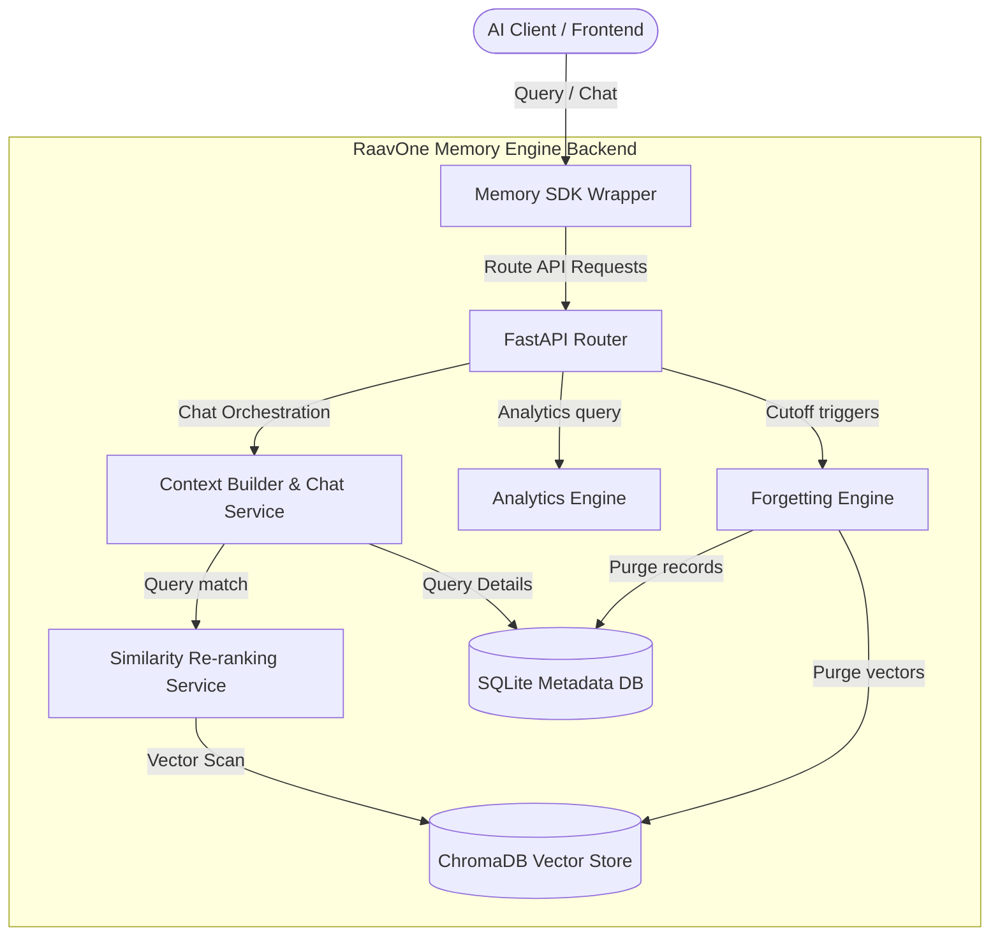
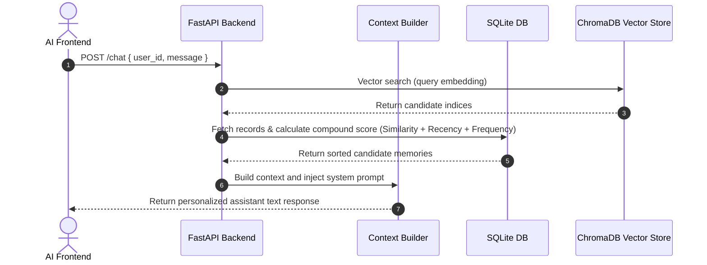

# 🧠 RaavOne Memory Engine `v3.0`

<p align="center">
  
</p>

<p align="center">
  <a href="https://github.com/mogesh-developer/RaavOne-Memory"></a>
  <a href="https://www.python.org/"></a>
  <a href="https://fastapi.tiangolo.com/"></a>
  <a href="https://www.trychroma.com/"></a>
</p>

<p align="center">
  <b>An intelligent, autonomous long-term semantic memory & user profiling engine built for production-grade AI agents and personalized chat assistants.</b>
</p>

---

## 📌 Table of Contents
* [🔥 All Features & The Use of Features](#-all-features--the-use-of-features)
* [🏗️ System Architecture](#%EF%B8%8F-system-architecture)
* [🔄 Data Flow Diagrams](#-data-flow-diagrams)
* [🚀 Getting Started](#-getting-started)
* [⚡ SDK Quick Start](#-sdk-quick-start)
* [📡 API Examples](#-api-examples)
* [📂 Folder Structure](#-folder-structure)
* [🗺️ Completed Phase Roadmap](#%EF%B8%8F-completed-phase-roadmap)

---

## 🔥 All Features & The Use of Features

| Feature | The Use of Feature / Why it Matters |
| :--- | :--- |
| **🛡️ Multi-User Data Isolation** | Prevents data leakage between users. Every database read, write, and search operation is sandboxed strictly by `user_id`. |
| **💬 Context Builder & Personalized Chat** | Assembles long-term memories relevant to the current user query and feeds them to the LLM system prompt for tailored assistant answers. |
| **🏷️ Memory Category Classification** | Automatically segments facts into 10 key domains (e.g. `Skill`, `Project`, `Preference`) for organized entity extraction. |
| **🧠 Compound Importance Score Ranking** | Combines Cosine Similarity, Recency, and Frequency to retrieve cognitive-grade memories rather than simple vector matches. |
| **⏳ Chronological Timeline Engine** | Compiles progression timelines chronologically so agents understand the user's roadmap journey over time. |
| **🗑️ Forgetting Engine** | Runs garbage collection cleanup. Removes low-importance temporary data (older than 30 days) to prevent index clutter. |
| **🔄 Conflict Resolution** | Detects state conflict overlaps (e.g., favorite framework switches) and updates records instead of making redundant copies. |
| **🔌 Unified SDK Wrapper Class** | Exposes simple static methods (`Memory.chat()`, `Memory.get_timeline()`) managing connection sessions out-of-the-box. |

---

## 🏗️ System Architecture



---

## 🔄 Data Flow Diagrams

### Chronological Memory Retrieval


---

## 🚀 Getting Started

### Prerequisites
* **Python 3.10+**
* **pip** (virtual environment recommended)

### Installation & Run

```bash
# 1. Clone the repository
git clone https://github.com/mogesh-developer/RaavOne-Memory.git
cd RaavOne-Memory

# 2. Setup a virtual environment
python -m venv venv
venv\Scripts\activate  # On Windows

# 3. Install packages in editable mode
pip install -e .

# 4. Configure Groq API key in your .env
echo GROQ_API_KEY=your_groq_api_key_here > .env

# 5. Launch the FastAPI server
uvicorn app.main:app --reload
```

---

## ⚡ SDK Quick Start

Integrate RaavOne Memory directly into your Python scripts:

```python
from raavone_core import Memory

# 1. Start a chat with long-term memory context
response = Memory.chat(user_id="mogesh", message="I want to learn Go language.")
print("AI Response:", response)

# 2. Retrieve user persona profile
profile = Memory.get_profile(user_id="mogesh")
print("User Profile:\n", profile)

# 3. Retrieve chronological milestones
timeline = Memory.get_timeline(user_id="mogesh")
print("User Timeline:\n", timeline)

# 4. View memory statistics and health
analytics = Memory.get_analytics(user_id="mogesh")
print("Analytics Stats:", analytics)
```

---

## 📡 API Examples

### 1. Semantic Memory Search
`POST /memory/search`
```bash
curl -X 'POST' \
  'http://localhost:8000/memory/search' \
  -H 'Content-Type: application/json' \
  -d '{
  "user_id": "mogesh",
  "query": "backend development stack"
}'
```

### 2. Run Forgetting Engine Cleanup
`POST /memory/cleanup`
```bash
curl -X 'POST' 'http://localhost:8000/memory/cleanup?days=30&importance_limit=3'
```

---

## 📂 Folder Structure

```
RaavOne-Memory/
│
├── app/
│   ├── models/           # SQLite schemas (Memory, Message, Session)
│   ├── routes/           # FastAPI routers (chat, memory endpoints)
│   ├── schemas/          # Pydantic schemas validation
│   ├── services/         # Core logic (chat, profile, timeline, forgetting, analytics)
│   ├── prompts/          # System prompt instruction templates
│   ├── database.py       # DB connection pool setup
│   └── main.py           # Application root entry point
│
├── raavone_core/         # SDK wrapper classes (Memory)
│
├── tests/                # Comprehensive test suites
│   ├── conftest.py
│   ├── test_chat.py
│   ├── test_memory.py
│   ├── test_profile.py
│   └── test_search.py
│
├── pyproject.toml        # Poetry / package configuration
└── README.md             # Developer documentation
```

---

## 🗺️ Completed Phase Roadmap

*   [x] **Base Infrastructure & DB Setup** (SQLite Schema, ChromaDB Persistent Collection)
*   [x] **Phase 1: Context Builder** (Personalized LLM chats with context injection)
*   [x] **Phase 2: Memory Categories** (Structured classification tags validation)
*   [x] **Phase 3: Importance Ranking** (Similarity + Recency + Frequency ranking)
*   [x] **Phase 4: Memory Summarizer** (Markdown user profiles generation)
*   [x] **Phase 5: Timeline Engine** (Chronological milestone progression visualization)
*   [x] **Phase 6: Forgetting Engine** (Cutoff cleanup filters)
*   [x] **Phase 7: Conflict Resolution** (Overwrites check during saving)
*   [x] **Phase 8: Multi-user Data Isolation** (user_id partition audits)
*   [x] **Phase 9: Memory Analytics** (Category breakdown counters stats)
*   [x] **Phase 10: Unified SDK Wrapper Client** (`Memory` class helper integration)
